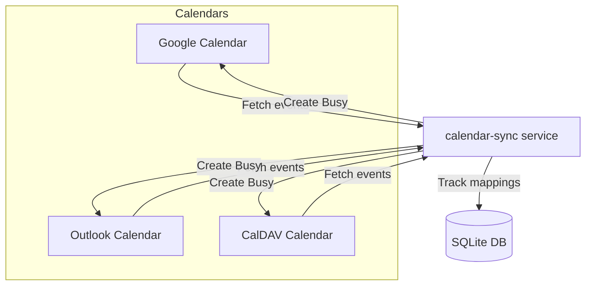

Сервис для автоматической синхронизации занятости между календарями разных систем (Google Calendar, Outlook, CalDAV и другие).

Если в одном календаре появляется встреча — сервис ставит соответствующее `Busy` событие в остальные календари.

---

## Особенности

- Поддержка Google Calendar, Microsoft 365 (Outlook), CalDAV.
- Отслеживание событий только на ближайшие 3 недели.
- Корректная работа с повторяющимися событиями (recurring events).
- Умная синхронизация: создание и удаление `Busy`-событий.
- Устойчивый к сбоям деплой в Kubernetes через Helm.
- База данных на SQLite для отслеживания синхронизированных событий.
- Полная автоматизация CI/CD через GitHub Actions.

---

## Архитектура



---

## Установка

### 1. Клонирование репозитория

```bash
git clone https://github.com/dimonb/calendar-sync.git
cd calendar-sync
```

---

### 2. Сборка образа Docker

```bash
docker build -t calendar-sync .
```

---

### 3. Настройка Kubernetes

Подготовить секреты и configmap:

```bash
kubectl create namespace calendar-sync

# Секреты с кредами доступа
kubectl create secret generic calendar-sync-secrets -n calendar-sync \
  --from-file=google_credentials.json \
  --from-file=microsoft_credentials.json

# ConfigMap с конфигурацией календарей
kubectl create configmap calendar-sync-config -n calendar-sync \
  --from-file=config.yaml
```

---

### 4. Деплой через Helm

```bash
helm upgrade --install calendar-sync ./charts/calendar-sync \
  --namespace calendar-sync \
  --create-namespace
```

---

## Конфигурация

**`config.yaml` пример:**

```yaml
calendars:
  - type: google
    id: your-google-calendar-id
    onlysource: true  # этот календарь используется только как источник событий
  - type: outlook
    id: your-outlook-calendar-id
  - type: caldav
    url: https://caldav.example.com/user/calendars/personal/

sync_window_days: 21
```

> `onlysource: true` — опциональный флаг. Если установлен, то календарь используется только как источник событий и в него не создаются Busy-события.

---

**`values.yaml` пример для Helm:**

```yaml
image:
  repository: ghcr.io/dimonb/calendar-sync
  tag: latest

schedule: "*/5 * * * *"

secrets:
  googleCredentialsSecret: calendar-sync-secrets
  microsoftCredentialsSecret: calendar-sync-secrets

config:
  configMapName: calendar-sync-config
```

---

## CI/CD

- При пуше в `main`:
  - Собирается Docker образ.
  - Публикуется в GitHub Container Registry `ghcr.io/dimonb/calendar-sync`.
  - Автоматически деплоится в Kubernetes через Helm.

---

## Требования

- Python 3.11+
- Kubernetes 1.21+
- Helm 3+
- Рабочий kubeconfig или токен для доступа к кластеру
- Доступ в GHCR для получения образов

---

## Лицензия

MIT License.  
Свободно используйте и модифицируйте.

---

## Авторы

- [Dmitrii Balabanov](https://github.com/dimonb)

