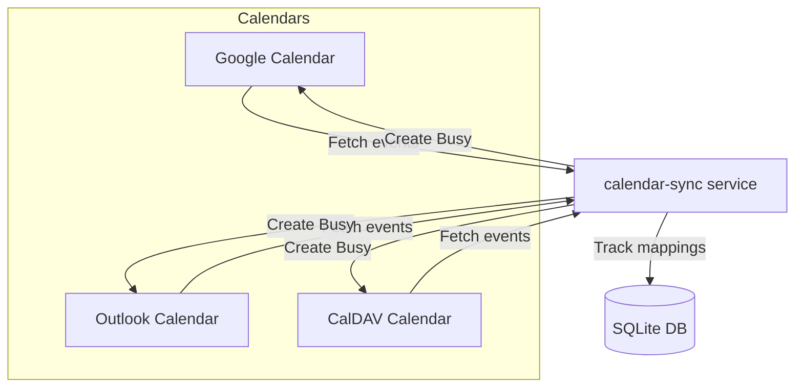

# calendar-sync


Service for automatic synchronization of "Busy" events between calendars in different systems (Google Calendar, Outlook, CalDAV, etc).

If a meeting appears in one of your calendars, the service creates a corresponding `Busy` event in all other connected calendars.

---

## Features

- Supports Google Calendar, Microsoft 365 (Outlook), and CalDAV.
- Watches for events only in the next N days (configurable via `sync_window_days`).
- Correctly handles recurring events.
- Smart synchronization: automatically creates and deletes `Busy` events as needed.
- Reliable, production-ready deployment in Kubernetes via Helm.
- Uses SQLite database to track synced events and prevent duplication.
- Full automation of CI/CD via GitHub Actions.

---

## Architecture


```mermaid
flowchart TD
    subgraph Calendars
        A[Google Calendar]
        B[Outlook Calendar]
        C[CalDAV Calendar]
    end

    D[calendar-sync service]
    E[(SQLite DB)]

    A -- Fetch events --> D
    B -- Fetch events --> D
    C -- Fetch events --> D
    D -- Create Busy --> A
    D -- Create Busy --> B
    D -- Create Busy --> C
    D -- Track mappings --> E
```

---

## Installation

### 1. Clone the repository

```bash
git clone https://github.com/dimonb/calendar-sync.git
cd calendar-sync
```

---

### 2. Build the Docker image

```bash
docker build -t calendar-sync .
```

---

### 3. Prepare Kubernetes secrets and configmap

Set up the required secrets and configuration map:

```bash
kubectl create namespace calendar-sync

# Secrets with credential files
kubectl create secret generic calendar-sync-secrets -n calendar-sync \
  --from-file=google_credentials.json \
  --from-file=microsoft_credentials.json

# ConfigMap with calendar configuration
touch config.yaml # (edit accordingly if needed)
kubectl create configmap calendar-sync-config -n calendar-sync \
  --from-file=config.yaml
```

---

### 4. Deploy with Helm

```bash
helm upgrade --install calendar-sync ./charts/calendar-sync \
  --namespace calendar-sync \
  --create-namespace
```

---

## Configuration

**Sample `config.yaml`**

```yaml
calendars:
  - type: google
    id: your-google-calendar-id
    credentials_path: /data/google_client_secret.json
    token_path: /data/token.json
    onlysource: true
  - type: outlook
    id: you@yourcompany.com
    credentials_path: /data/outlook_client.json
    token_path: /data/token_outlook.json
    # graph_calendar_id: <id>   # optional: read a non-primary calendar
    # busy_calendar_id: <id>    # optional: write Busy events to a separate calendar
  - type: caldav
    url: https://caldav.example.com/user/calendars/personal/

sync_window_days: 14
```

> `onlysource: true` is an optional flag. When set, this calendar is only used as a source of events and no Busy events will be created in it.

Notes:
- For Google Calendar integration, you must provide valid `credentials_path` and `token_path` (see Google documentation for preparing OAuth credentials).
- For CalDAV support, you must provide the `url`, `username`, and `password` in the calendar block.
- For Outlook / Microsoft 365 integration, you must provide `credentials_path` (Azure app registration) and `token_path` (MSAL token cache). See the [Outlook setup](#microsoft-365--outlook-setup) section below.

---

**Sample `values.yaml` for Helm**

```yaml
image:
  repository: ghcr.io/dimonb/calendar-sync
  tag: latest

schedule: "*/5 * * * *"

secrets:
  googleCredentialsSecret:
    name: calendar-sync-secrets
    data:
      google_client_secret: <base64 encoded secret>
  microsoftCredentialsSecret:
    name: calendar-sync-secrets
    data:
      microsoft_client_secret: <base64 encoded secret>

config:
  configMapName: calendar-sync-config
```

---

## CI/CD

- On push to `main`:
  - Docker image is built
  - Published to GitHub Container Registry `ghcr.io/dimonb/calendar-sync`
  - Automatically deployed to Kubernetes using Helm

---

## Requirements

- Python 3.11+
- Kubernetes 1.21+
- Helm 3+
- Working kubeconfig or access token for your cluster
- Access to GitHub Container Registry (GHCR) for downloading images

---

## License

MIT License. 
Feel free to use and modify.

---

## Authors

- [Dmitrii Balabanov](https://github.com/dimonb)

---

## FAQ / Troubleshooting

- **Google Calendar setup:**
  - The service requires OAuth2 credentials. See Google's official documentation to create client credentials and download as `client_secret.json`.
  - The first time you run calendar-sync it will prompt your browser for consent. The resulting token is cached in the `token.json` or whatever path you set as `token_path`.

- **CalDAV setup:**
  - Some CalDAV providers require app-specific passwords or two-factor authentication adjustments. Make sure your credentials work in your CalDAV client before using them in calendar-sync.
  - CalDAV is **not** supported for Microsoft 365 / Outlook.com (Microsoft removed it). Use the `outlook` type instead.

### Microsoft 365 / Outlook setup

The `outlook` backend uses the Microsoft Graph API with delegated OAuth2 (MSAL).
It supports both reading events and creating/deleting `Busy` events.

**1. Register an app in Azure (Entra)**

In the [Azure portal](https://portal.azure.com) → *App registrations* → *New registration*:

- Supported account types: *Accounts in this organizational directory only* (single tenant) is fine for a work/school account.
- Under **Authentication**: set *Allow public client flows* = **Yes** (required for the device-code login).
- Under **API permissions**: add *Microsoft Graph → Delegated → `Calendars.ReadWrite`*, then grant consent. (`offline_access` is requested automatically so the refresh token persists.)

Copy the **Application (client) ID** and **Directory (tenant) ID**.

**2. Create the credentials file**

```json
{ "client_id": "<application-client-id>", "tenant_id": "<directory-tenant-id>" }
```

Save it as e.g. `outlook_client.json` and point `credentials_path` at it.

**3. Mint the token cache (once, interactively)**

```bash
.venv-auth/bin/python mint_outlook_token.py
```

It prints a URL and a code — open the URL, sign in as the target account, grant
access. The token cache is written to `token_path` (e.g. `dimonb-token-outlook.json`)
and refreshed silently on every sync afterwards. In Kubernetes, mount this file
(and `outlook_client.json`) into `/data` via a secret.

**Config fields:**

| Field | Required | Description |
|-------|----------|-------------|
| `id` | yes | Unique label for this calendar (use the account's email). |
| `credentials_path` | yes | Path to the `{client_id, tenant_id}` JSON. |
| `token_path` | yes | Path to the MSAL token cache (created by `mint_outlook_token.py`). |
| `graph_calendar_id` | no | Graph calendar id to read from; defaults to the primary calendar. |
| `busy_calendar_id` | no | Graph calendar id to write `Busy` events to. |
| `onlysource` | no | `true` = read only, never create `Busy` events here. |

- **How do I only sync FROM one calendar?**
  - Use `onlysource: true` in the config.

---

For issues, discussions, and updates: see the [GitHub repository](https://github.com/dimonb/calendar-sync).
